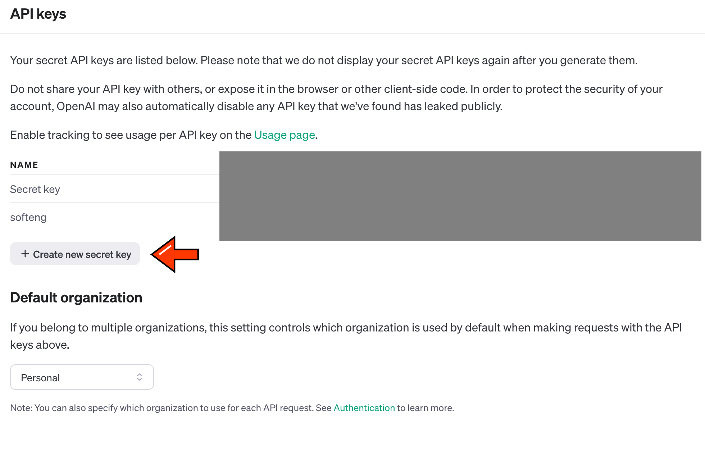
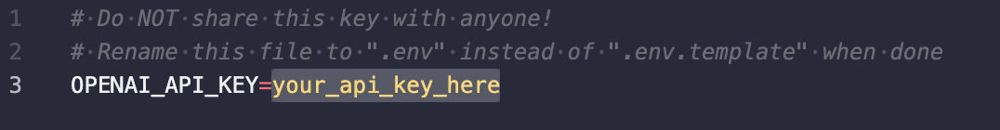

# [The Onion](https://www.theonion.com) Article Web Scraper

Scrape multiple URLs provided in a text file, each outputting as a JSON file.

## How to Use

1. **Install Required Tools**:
   - [Conda](https://docs.conda.io/en/latest/)
   - [Git CLI](https://cli.github.com/)

2. **Clone the Repository**:  
   Clone this repository onto your local machine using Git CLI:
   ```bash
   git clone https://github.com/niblicat/onionscrape.git
   ```

3. **Set Up Environment**:
   - Navigate to the scraper directory (contains `scraper.py` and `environment.yml`) in the terminal.
   - Copy the Python environment using Conda:
     ```bash
     conda env create -f environment.yml
     ```

4. **Activate Environment**:
   To activate the environment, enter:
   ```bash
   conda activate onionscrape
   ```

5. **That's it!**:
   Now you are ready to use the scraper.

## Usage

Run the scraper on an input file named `input.txt` using the following command:
```bash
python run.py input.txt
```

To customize the JSON output file name, utilize the `--output` argument. For instance:
```bash
python run.py input.txt --output funny
```
This will generate `funny0.json`, `funny1.json`, ..., `funnyN.json` in the processed directory based on an `input.txt` file containing N URLs.

To generate a summary for each URL in your input, employ the `--summary` argument. This will require obtaining an OpenAI API key. Follow the instructions below for more information.
```bash
python run.py input.txt --summary
```
This will produce `output0.txt`, `output1.txt`, ..., `outputN.txt` in the summary directory given an `input.txt` file containing N URLs.

### Summaries

You can generate a summary using the power of GPT 3.5. To set up an API key for this program, follow these steps:

1. **Open the OpenAI API Page**:
   - Navigate to the [https://openai.com/blog/openai-api](OpenAI API website) and sign up or login. Note that you may have to pay for credits if you are using an existing account. 

2. **Make a new API key**:
   - Visit the [API key page](https://platform.openai.com/api-keys). From here, you can create a new API key by with the "Create new secret key" button, shown below:

   - Name the key anything you want. Once generated, save the key somewhere, because you won't be able to copy it later!

3. **Editing .env**:
   - Place your key inside of the `.env.template` file, replacing the text that says "your_api_key_here". Then, rename the file to `.env`.


4. **Testing your key**:
   - Use the below command to test your API key. Hopefully, you should receive a message from a very silly goober if you have succeeded.
   ```bash
   python gpttest.py
   ```

## Output

The processed output will be found inside `Data/processed`.

See output0.json for an example of the expected output for the [Pros and Cons of Shutting Down The Border article](https://www.theonion.com/pros-and-cons-of-shutting-down-the-border-1851235755).