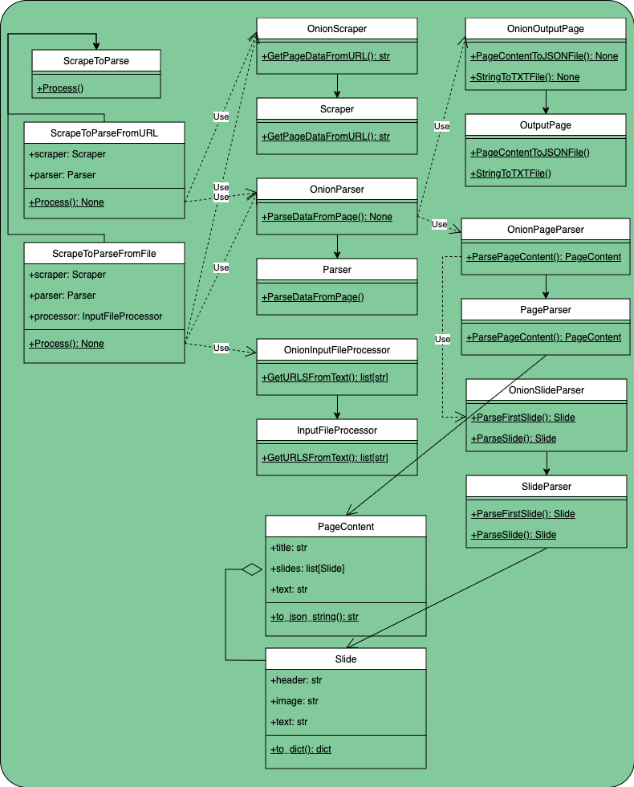

# [The Onion](https://www.theonion.com) Article Web Scraper

Scrape multiple URLs provided in a text file, each outputting as a JSON file.

## How to Use

1. **Install Required Tools**:
   - [Conda](https://docs.conda.io/en/latest/)
   - [Git CLI](https://cli.github.com/)

2. **Clone the Repository**:  
   Clone this repository onto your local machine using Git CLI:
   ```bash
   git clone https://github.com/niblicat/onionscrape.git
   ```

3. **Set Up Environment**:
   - Navigate to the scraper directory (contains `scraper.py` and `environment.yml`) in the terminal.
   - Copy the Python environment using Conda:
     ```bash
     conda env create -f environment.yml
     ```

4. **Activate Environment**:
   To activate the environment, enter:
   ```bash
   conda activate onionscrape
   ```

5. **That's it!**:
   Now you are ready to use the scraper.

## Usage

Run the scraper on an input file `input.txt` using the following command:
```bash
python run.py input.txt
```

To change the default JSON output file name, use the `--output` argument. For example:
```bash
python run.py input.txt --output funny
```
This will output `funny0.json`, `funny1.json`, ... , `funnyN.json` given an `input.txt` file containing N URLs.

## Output

The processed output will be found inside Data/processed

See output0.json for an example of the expected output for the [Pros and Cons of Shutting Down The Border article](https://www.theonion.com/pros-and-cons-of-shutting-down-the-border-1851235755).

## Limitations

This scraper will not work on pages featuring only an image with no paragraph content.

